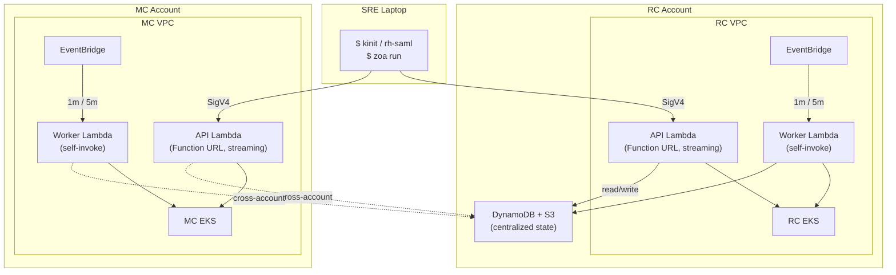
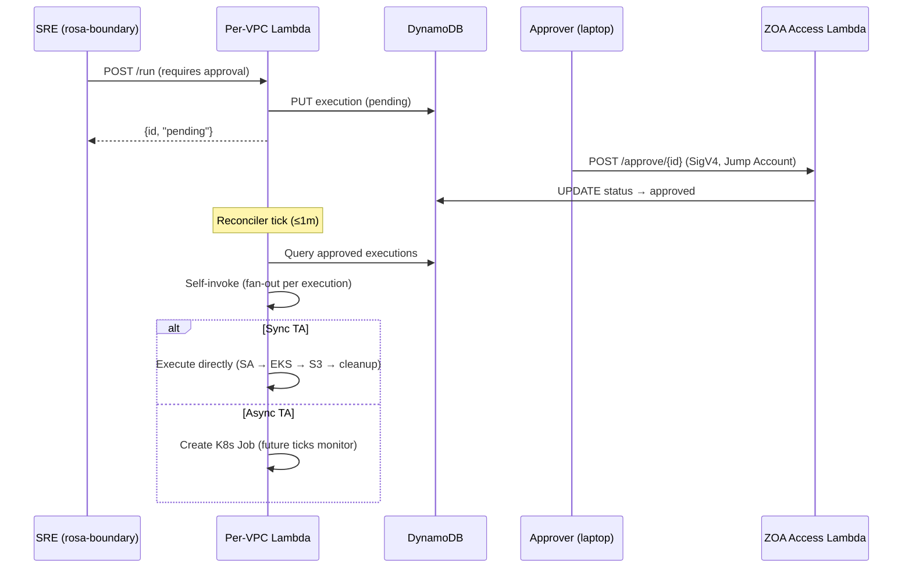

# Zero Operator Access (ZOA) — Architecture

**Last Updated Date**: 2026-09-14

## Summary

ZOA ensures that operators have **no persistent, interactive, or unaudited access** to customer infrastructure. All operational actions are executed through pre-defined, audited Trusted Actions (TAs) via a fully serverless execution engine (Lambda, DynamoDB, S3, EventBridge).

ZOA is independent of the Regional Cluster's Platform API or any Kubernetes workload — the tool to fix the platform does not depend on the platform being healthy.

> For code-level architecture details (execution flows, SA isolation, streaming adapter, TA development), see the [ZOA repository documentation](https://github.com/openshift-online/rosa-hyperfleet-zoa/blob/main/README.md).

## Context

- **Problem Statement**: Traditional managed-service operations require operators to have standing access (kubeconfig, IAM roles, bastion hosts). This creates unaudited access paths, persistent credentials, no accountability, and compliance gaps. FedRAMP requires complete audit trails for all privileged operations.
- **Failure Domain Minimization**: The tool used to fix the platform must not depend on the platform being healthy. For sync TAs (the common case), the execution path has 3 failure domains — all AWS-managed: Lambda, DynamoDB, EKS API server. No custom K8s workloads, no pods, no operators in the critical path. Lambdas deploy per-VPC to isolate failure domains — one cluster's ZOA outage cannot cascade to another.
- **Constraints**: Lambda only admits ECR as image source; Function URLs require IAM auth; cross-account access must use STS AssumeRole; all data encrypted at rest (KMS).
- **Assumptions**: Each target VPC has an EKS cluster reachable from the Lambda's subnet. DynamoDB is the shared state store (regional, in RC account). CLI authenticates via SigV4.

## Architecture

**Composite sync availability: 99.95%** (~22 min/month downtime budget). The sync execution path has only 3 failure domains — all AWS-managed: Lambda (99.95%), DynamoDB (99.999%), and EKS API (99.95%). No custom K8s workloads, no pods, no operators in the critical path.

Each target VPC (RC and every MC) gets an independent pair of Lambda functions from the same container image (`zoa-lambda`), differentiated by the `HANDLER_MODE` environment variable:

| Lambda     | Invoke Mode       | Trigger                             | Purpose                                                           | Timeout | Concurrency |
| ---------- | ----------------- | ----------------------------------- | ----------------------------------------------------------------- | ------- | ----------- |
| **API**    | `RESPONSE_STREAM` | Function URL (IAM auth)             | HTTP handler for CLI, sync TA execution, streaming responses      | 300s    | 50          |
| **Worker** | `BUFFERED`        | EventBridge Scheduler + self-invoke | Reconciler (1m), GC (5m), async/approved TA execution via fan-out | 300s    | 10          |

Both use `lambda.Start()` from `aws-lambda-go`. The API Lambda uses a native Go streaming adapter (`LambdaFunctionURLStreamingResponse`) supporting responses up to 200MB — no external proxy or sidecar. The Worker uses standard JSON responses for EventBridge and self-invocation events.



> For the complete architecture diagram including all component interactions, see the [ZOA README — Architecture](https://github.com/openshift-online/rosa-hyperfleet-zoa/blob/main/README.md#architecture).

### Authentication & Caller Boundaries

#### Current State

Today, SREs call the per-VPC Lambda Function URL directly from their laptop:

1. `kinit` (requires Red Hat VPN) → `rh-aws-saml-login` → IAM role with `lambda:InvokeFunctionUrl` permission
2. `zoa` CLI calls the Function URL directly (SigV4 with the operator's IAM role)
3. Lambda extracts caller identity from SigV4 headers (Account ID, ARN, session name) and records it on every execution

The Function URL's resource-based policy restricts which IAM principals can invoke it. Caller identity is immutable (derived from SigV4, not from request body).

#### Target State (with rosa-boundary + ZOA Access Lambda)

Two distinct authentication domains will protect ZOA endpoints:

```
SRE Laptop                                      rosa-boundary (ECS task in target VPC)
    │                                                       │
    │ kinit → rh-aws-saml-login                             │ ECS task IAM role
    │ → Jump Account IAM role                               │ (injected at task creation)
    │                                                       │
    ▼                                                       ▼
ZOA Access API Gateway                          Lambda Function URL (per-VPC)
(public, IAM auth, custom domain)               (private, IAM auth, no custom domain)
    │                                                       │
    │ Resource policy:                                      │ Resource-based policy:
    │ ONLY Jump Account roles                               │ ONLY rosa-boundary task roles
    │                                                       │
    ▼                                                       ▼
ZOA Access Lambda                               ZOA Lambda (per-VPC)
(session mgmt, approvals)                       (TA execution, break-glass)
```

**From laptop** (session management + approvals only):

1. `kinit` (requires Red Hat VPN — only step that does)
2. `rh-aws-saml-login jump-account-{env}` → temporary IAM role in Jump Account
3. `rosa-boundary start-task --region R --target T` → calls ZOA Access API Gateway (SigV4, custom domain derived from `--region`)
4. ZOA Access Lambda creates an ECS Fargate task in the target VPC, injects `ZOA_ENDPOINT` (Function URL)
5. SRE connects to the container via AWS SSM (`aws ecs execute-command`) → interactive shell

**From rosa-boundary** (all TA operations):

1. SRE is inside the ECS container (connected via SSM session)
2. ECS task role provides SigV4 identity automatically
3. `zoa` CLI reads `ZOA_ENDPOINT` env var → calls the per-VPC Lambda Function URL
4. Lambda validates that the caller ARN matches the rosa-boundary task role for this VPC

**From laptop** (approvals — no container needed):

1. `zoa approve <id> --region R --target T` → calls ZOA Access API Gateway directly (SigV4, Jump Account role)
2. ZOA Access Lambda writes `status=approved` to DynamoDB
3. Per-VPC Lambda reconciler picks it up on next tick

This separation means: a compromised laptop credential (Jump Account role) cannot execute TAs — it can only create sessions and approve requests. A compromised rosa-boundary task role can only reach its own VPC's Lambda — it has no path to other clusters.

### Execution Modes (Sync vs Async)

Each Trusted Action declares its execution mode. The mode determines how the TA runs and where output is generated:

|                       | Sync                                                       | Async                                                                           |
| --------------------- | ---------------------------------------------------------- | ------------------------------------------------------------------------------- |
| **Executor**          | API Lambda (inline) or self-invoked Worker Lambda          | K8s Job (`zoa-runner` container) on target EKS                                  |
| **Output delivery**   | Streamed in Lambda response (up to 200MB) + archived to S3 | Written to S3 by the Job; retrieved via API Lambda streaming (same 200MB limit) |
| **Use case**          | Read operations, quick mutations (seconds)                 | Long-running operations, large outputs, needs its own pod lifecycle             |
| **Timeout**           | Bounded by Lambda timeout (300s)                           | Bounded by K8s Job `activeDeadlineSeconds` (configurable per TA)                |
| **CLI experience**    | Blocks until complete, streams output                      | Returns immediately with execution ID; poll with `zoa get` or `--wait`          |
| **Output size limit** | 200MB (Lambda streaming)                                   | 200MB (retrieved via API Lambda streaming; S3 stores the full artifact)         |

Both modes create per-execution K8s RBAC (ServiceAccount + Role + RoleBinding) that is destroyed after completion. For `kube-api` scope TAs, the Lambda uses SA impersonation (`rest.ImpersonationConfig`) so the K8s audit log reflects only the declared RBAC — not the Lambda's own broad permissions. For async mode, a scoped STS Secret is also created (S3 upload-only credentials restricted to the execution's prefix via session policy). For `aws-api` scope TAs, dedicated IAM roles (`zoa-aws-read` / `zoa-aws-write`) are assumed per-execution via STS with a session policy scoped to the specific TA's declared permissions.

> For full sequence diagrams of both modes, see [Implementation Details](https://github.com/openshift-online/rosa-hyperfleet-zoa/blob/main/docs/architecture/implementation.md).

### Per-VPC Isolation

Each cluster's ZOA is fully independent. A failure in one VPC cannot cascade — no cross-VPC networking, no shared control plane in the execution path. Blast radius = 1 cluster.

### Self-Invocation (Worker Fan-Out)

The Worker Lambda invokes **itself** to dispatch approved TA executions. Each self-invocation handles exactly one execution in its own concurrent slot:

1. Reconciler tick (every 1m) queries DynamoDB for `status=approved` executions
2. Atomically transitions each to `status=dispatched` (conditional write prevents double-dispatch)
3. Self-invokes once per execution with `InvocationType=Event` (async, fire-and-forget):
   ```json
   { "route": "execute", "execution_id": "abc123" }
   ```
4. AWS Lambda queues each invocation and executes it in a separate concurrent slot
5. The new Lambda instance then operates based on the TA's execution mode:
   - **Sync mode**: Creates SA + RBAC → impersonates SA → executes TA directly against EKS API → uploads output to S3 → cleans up K8s resources → updates DynamoDB. All within one Lambda invocation.
   - **Async mode**: Creates SA + RBAC + STS Secret (scoped S3 upload credentials) + K8s Job → updates DynamoDB to `running` → returns. Future reconciler ticks monitor the Job status, update DynamoDB on completion, and clean up K8s resources.

`reserved_concurrency=10` ensures max 9 concurrent TA executions + 1 slot reserved for the reconciler/GC tick. Excess invocations queue in Lambda's internal retry queue (up to 6 hours). This avoids SQS complexity while maintaining concurrency control and backpressure.

### DLQ Semantics

The SQS dead-letter queue (SSE-SQS encrypted, 14-day retention) is only effective for the **Worker** Lambda:

- EventBridge and self-invoke are async — failures land in the DLQ after retry exhaustion
- The API Lambda returns errors directly to the caller (429/5xx) — DLQ cannot capture synchronous Function URL failures

### Response Streaming

The API Lambda uses native Go response streaming (`LambdaFunctionURLStreamingResponse`) via a custom adapter in `pkg/lambdahttp/`. This:

- Converts Function URL events to standard `net/http` requests
- Passes them through the Go HTTP router
- Returns streaming responses up to 200MB (bypasses the 6MB synchronous Lambda limit)
- Uses no external binaries or sidecars (pure Go, UBI-minimal base image)

## Terraform Modules

```
terraform/modules/zoa/          → Regional data layer (one per region, lives in RC account)
                                  DynamoDB, S3, KMS, ECR, IAM roles

terraform/modules/zoa-lambda/   → Per-VPC compute (one per target VPC: RC + each MC)
                                  Lambdas, EventBridge, SQS DLQ, CloudWatch Logs, EKS access
```

### `modules/zoa/` — Regional Shared Data Layer

| Resource              | Details                                                                                                                                                                      |
| --------------------- | ---------------------------------------------------------------------------------------------------------------------------------------------------------------------------- |
| DynamoDB (executions) | PK=executionId, 4 GSIs (account-index, status-index, target-index, target-status-index). On-demand billing, PITR enabled, deletion protection (disabled for ephemeral envs). |
| DynamoDB (audit)      | PK=accountId, SK=timestamp (nanosecond precision for uniqueness). Every audited API call.                                                                                    |
| S3 bucket             | `zoa-artifacts-{region}`. KMS-SSE, versioning, lifecycle (Intelligent-Tiering 30d, expire 365d). Stores output.json and execution.log per execution.                         |
| KMS key               | Symmetric key for DynamoDB + S3 encryption at rest. Key policy allows Lambda execution roles and cross-account MC roles.                                                     |
| ECR repository        | Hosts `zoa-lambda` images mirrored from Quay via skopeo. Lifecycle retains last 20 images. Cross-account pull policy scoped to MC OU path.                                   |
| IAM: zoa-uploader     | Scoped `s3:PutObject` + `kms:GenerateDataKey` for async runner K8s Jobs. Assumed via STS from runner pods.                                                                   |
| IAM: zoa-data-access  | Cross-account role for MC Lambdas to reach RC's DynamoDB and S3. Trust policy scoped to MC account OU.                                                                       |

### `modules/zoa-lambda/` — Per-VPC Compute

| Resource                    | Details                                                                                                                                                               |
| --------------------------- | --------------------------------------------------------------------------------------------------------------------------------------------------------------------- |
| API Lambda                  | Function URL (`AWS_IAM` auth type), invoke mode `RESPONSE_STREAM`, x86_64 container from ECR, VPC-attached to private subnets, 512MB memory.                          |
| Worker Lambda               | No Function URL. EventBridge-triggered + self-invoke. Same image, VPC, memory.                                                                                        |
| IAM execution role (shared) | Single role for both Lambdas: DynamoDB read/write, S3 read/write, EKS describe, STS AssumeRole (for TA-scoped roles + uploader), Lambda self-invoke, CloudWatch Logs. |
| IAM: zoa-aws-read           | Per-TA scoped role for AWS read operations (EKS DescribeCluster, EC2 DescribeInstances/VPCs/Subnets/SecurityGroups). Assumed per-execution via STS.                   |
| IAM: zoa-aws-write          | Per-TA scoped role for AWS write operations. Grows incrementally as write TAs are added.                                                                              |
| SQS DLQ                     | Dead letters for Worker async failures. SSE-SQS, 14-day retention. One per Lambda pair.                                                                               |
| CloudWatch Logs             | Log groups with 365-day retention, KMS-encrypted (customer-managed key, consistent with platform standard). JSON structured logging.                                  |
| EKS access entry            | Grants Lambda execution role access to target EKS cluster with a Kubernetes group for RBAC binding.                                                                   |
| Security group              | Egress to EKS API (443) and AWS service endpoints. No inbound rules (Function URL handles ingress).                                                                   |
| EventBridge Scheduler       | Two schedules: reconciler (1m) + GC (5m). Both gated by `enable_reconciler` variable.                                                                                 |

### RC/MC Config Wiring

- **RC** instantiates both modules: `modules/zoa` (shared resources) + `modules/zoa-lambda` (RC-local Lambda pair). Exports data-access role ARN and ECR URL as outputs for MC consumption.
- **MC** instantiates `modules/zoa-lambda` only, consuming RC outputs (ECR URL, DynamoDB ARNs/names, S3 bucket, KMS key ARN, data-access role ARN, uploader role ARN).
- **Cross-account access**: MC Lambdas assume `zoa-data-access` role via STS to reach RC's DynamoDB and S3. Both DynamoDB tables and S3 bucket also have resource-based policies scoped by MC OU path — defense in depth (either mechanism alone would suffice).

## Tunable Parameters

All configuration is via Terraform variables that map to Lambda environment variables — no code changes or redeployment required beyond `terraform apply`:

| Variable                      | Default | Lambda Env Var                | Purpose                                             |
| ----------------------------- | ------- | ----------------------------- | --------------------------------------------------- |
| `lambda_api_timeout`          | 300     | (Lambda config)               | API Lambda hard ceiling (seconds)                   |
| `lambda_worker_timeout`       | 300     | (Lambda config)               | Worker Lambda hard ceiling (seconds)                |
| `lambda_api_concurrency`      | 50      | (Lambda config)               | Max concurrent API invocations                      |
| `lambda_worker_concurrency`   | 10      | (Lambda config)               | Max concurrent Worker invocations                   |
| `reconciler_deadline_seconds` | 55      | `RECONCILER_DEADLINE_SECONDS` | Code-level deadline for reconciler/GC ticks         |
| `max_batch_per_tick`          | 30      | `MAX_BATCH_PER_TICK`          | Items processed per scheduled phase per tick        |
| `lambda_memory_size`          | 512     | (Lambda config)               | Memory in MB (CPU scales proportionally)            |
| `enable_reconciler`           | true    | (EventBridge state)           | Toggle EventBridge schedules on/off                 |
| `dynamodb_ttl_days`           | 365     | `DYNAMODB_TTL_DAYS`           | Record retention (FedRAMP: minimum 365 days)        |
| `write_cooldown_seconds`      | 300     | `WRITE_COOLDOWN_SECONDS`      | Per-target rate limit between same write TA         |
| `max_concurrent_per_target`   | 10      | `MAX_CONCURRENT_PER_TARGET`   | Max parallel pending+running executions per target  |
| `log_level`                   | info    | `LOG_LEVEL`                   | Structured log verbosity (debug, info, warn, error) |

## Security Model

| Layer                  | Mechanism                                                                                                                                                                                                                               |
| ---------------------- | --------------------------------------------------------------------------------------------------------------------------------------------------------------------------------------------------------------------------------------- |
| API authentication     | Function URL with `AWS_IAM` auth type — requires valid SigV4 signature from caller                                                                                                                                                      |
| Caller identity        | Extracted from SigV4: Account ID, Caller ARN, operator name (from session name). Recorded on every execution.                                                                                                                           |
| Network isolation      | Lambda runs inside the target VPC (private subnets only). No public endpoints.                                                                                                                                                          |
| Cross-account data     | STS AssumeRole (identity-based) + resource-based policies on DynamoDB/S3 (defense in depth)                                                                                                                                             |
| TA-scoped permissions  | Separate `zoa-aws-read` and `zoa-aws-write` IAM roles assumed per execution via STS session policy                                                                                                                                      |
| K8s RBAC per execution | Per-execution ServiceAccount (`zoa-runner-<exec-id>`) with minimal Role from TA template                                                                                                                                                |
| Encryption at rest     | KMS for DynamoDB + S3 + CloudWatch Logs; SQS server-side encryption (SSE-SQS) for DLQ                                                                                                                                                   |
| Audit trail            | Every API call → DynamoDB audit table. Every execution → DynamoDB executions table. Logs → CloudWatch (365d).                                                                                                                           |
| Jira enforcement       | Every execution requires a Jira ticket ID. Validated at API level (format: `PROJECT-123`).                                                                                                                                              |
| EKS circuit breaker    | Trips after 3 consecutive EKS API failures within 30s; fast-fails for 60s to prevent timeout exhaustion. See [`circuit_breaker.go`](https://github.com/openshift-online/rosa-hyperfleet-zoa/blob/main/pkg/executor/circuit_breaker.go). |

For the full security model (threat model, SA isolation strategies, RBAC design), see [Implementation Details](https://github.com/openshift-online/rosa-hyperfleet-zoa/blob/main/docs/architecture/implementation.md) in the ZOA repository.

## Deployment Flow

```
Konflux/Tekton → builds container image (x86_64, UBI-minimal)
     │
     ▼
Quay registry (quay.io/redhat-user-workloads/rosa-tenant/zoa-lambda:<commit-sha>)
     │
     ▼ (pipeline step: skopeo mirror — temporary until Konflux pushes to ECR directly)
ECR repository (in RC account, cross-account pull policy for MC accounts)
     │
     ▼ (Terraform variables: zoa_lambda_image_tag / zoa_runner_image_tag)
terraform apply → updates Lambda functions and K8s Job runner to use new images
```

**Rollback**: Set `zoa_lambda_image_tag` (and/or `zoa_runner_image_tag`) to a previous commit SHA and `terraform apply`. Lambda picks up the ECR image immediately on next cold start. No draining, no rolling update — existing warm instances continue until their next invocation timeout.

## Observability

| Signal                   | Source               | Status    | How                                                                                          |
| ------------------------ | -------------------- | --------- | -------------------------------------------------------------------------------------------- |
| Invocation errors        | AWS/Lambda namespace | Available | YACE scrape → Prometheus/Thanos; Grafana **Lambda** + **ZOA** dashboards                     |
| Duration P50/P99         | AWS/Lambda namespace | Available | YACE `Duration` Average + p99                                                                |
| Throttles / concurrency  | AWS/Lambda namespace | Available | YACE `Throttles`, `ConcurrentExecutions`                                                     |
| DLQ depth                | AWS/SQS              | Available | YACE `ApproximateNumberOfMessagesVisible` on `*-zoa-dlq`; pages if > 0 for 5m                |
| Business metrics         | ZOA custom namespace | Available | EMF from Go (`ExecutionCount`, HTTP, rejections, reconciler/GC, circuit breaker)             |
| Execution outcomes       | DynamoDB             | Available | Queryable via `zoa runs --status failed --target X` (forensics, not SLIs)                    |
| Logs                     | CloudWatch Logs      | Available | 365-day retention, JSON structured, filterable via CW Insights                               |
| CW Exporter → Prometheus | YACE on RC + MC      | Available | Discovery: `AWS/Lambda`, `AWS/SQS`; top-level `customNamespace` job for `ZOA`                |
| PrometheusRules alerting | Thanos Ruler (RC)    | Available | `alerting-rules/templates/zoa.yaml` — DLQ, worker errors, reconciler heartbeat, TA/API rates |

Two Grafana dashboards: **Lambda** (infrastructure) and **ZOA** (unified service view with SLO panels, activity breakdowns, per-TA drill-down, and worker pipeline health).

### Source of Truth

| What                         | Location                                                                                                                                                                                   |
| ---------------------------- | ------------------------------------------------------------------------------------------------------------------------------------------------------------------------------------------ |
| Recording rules and alerts   | [`alerting-rules/templates/zoa.yaml`](https://github.com/openshift-online/rosa-hyperfleet/blob/main/argocd/config/regional-cluster/alerting-rules/templates/zoa.yaml)                      |
| Dashboard                    | [`grafana/dashboards/zoa/zoa.json`](https://github.com/openshift-online/rosa-hyperfleet/blob/main/argocd/config/regional-cluster/grafana/dashboards/zoa/zoa.json)                          |
| YACE scrape config (RC)      | [`cloudwatch-exporter/values.yaml` (RC)](https://github.com/openshift-online/rosa-hyperfleet/blob/main/argocd/config/regional-cluster/cloudwatch-exporter/values.yaml)                     |
| YACE scrape config (MC)      | [`cloudwatch-exporter/values.yaml` (MC)](https://github.com/openshift-online/rosa-hyperfleet/blob/main/argocd/config/management-cluster/cloudwatch-exporter/values.yaml)                   |
| EMF metrics catalog and logs | [ZOA observability docs](https://github.com/openshift-online/rosa-hyperfleet-zoa/blob/main/docs/observability.md)                                                                          |

## Cost

| Component             | Pricing model                                         | Estimate (per cluster, moderate use) |
| --------------------- | ----------------------------------------------------- | ------------------------------------ |
| Lambda (API + Worker) | Per-ms execution + per-request ($0.20/1M). Zero idle. | < $5/month                           |
| DynamoDB (on-demand)  | $1.25/1M writes, $0.25/1M reads                       | < $2/month                           |
| S3 (artifacts)        | Standard + Intelligent-Tiering (30d) + expire (365d)  | < $1/month                           |
| EventBridge Scheduler | Free tier covers all schedules                        | $0                                   |
| CloudWatch Logs       | $0.50/GB ingested                                     | < $3/month                           |
| ECR                   | $0.10/GB stored                                       | < $0.50/month                        |
| **Total per VPC**     |                                                       | **< $12/month**                      |

Graviton/arm64 migration planned for ~20% Lambda cost reduction.

---

> **Everything above this line is implemented and deployed.** Sections below describe features that are designed and validated but not yet built. As each feature ships, it will be moved into the main body of this document.

## Future Considerations

### ZOA Access Lambda

A dedicated Lambda (no VPC attachment, in the RC account) behind a public API Gateway with a custom domain (`https://zoa-access.{region}.rosa.example.com`):

| Concern                    | Access Lambda                                    | Per-VPC Lambda                                                                                                                                                                 |
| -------------------------- | ------------------------------------------------ | ------------------------------------------------------------------------------------------------------------------------------------------------------------------------------ |
| VPC-attached               | No                                               | Yes (direct EKS access)                                                                                                                                                        |
| Cold start                 | ~200ms (no VPC)                                  | Under 100ms to over 1s ([AWS docs](https://docs.aws.amazon.com/lambda/latest/dg/lambda-runtime-environment.html)); VPC adds < 50ms with Hyperplane. Go is in the fastest tier. |
| Must work when EKS is down | Yes (session creation bootstraps access)         | Partially (TAs need EKS)                                                                                                                                                       |
| Permitted callers          | Jump Account roles only (API GW resource policy) | rosa-boundary task roles only (Lambda resource policy)                                                                                                                         |
| WAF protection             | Yes (IP-based rules, geo-blocking)               | Not needed (callers are ECS tasks in same VPC)                                                                                                                                 |

Responsibilities:

- **Session management**: `ecs:RunTask` to create rosa-boundary containers in target VPCs, inject `ZOA_ENDPOINT`
- **Approval/rejection**: write `approved`/`rejected` status to DynamoDB (per-VPC reconciler handles activation)
- **Placement routing**: resolve target cluster → VPC → Function URL from `boundary-targets` DynamoDB table
- **Cross-account session creation**: `sts:AssumeRole` into MC account to run ECS tasks there

Key design choice: the Access Lambda does NOT create EKS access entries or execute TAs. All target operations go through the per-VPC Lambda. This keeps IAM minimal and the architecture uniform.

### Break-Glass Access

A `/breakglass/` API path will provide escalated access when normal TAs are insufficient:

- Requires multi-party approval (approver != requester, same SRE group)
- Uses `eks:CreateAccessEntry` (per-VPC Lambda, local, same account) to grant temporary cluster access
- Scopes: `kube-read`, `kube-write`, `kube-admin` (mapped to pre-deployed ClusterRoleBindings); `aws-read`, `aws-write`, `aws-admin` (STS-based)
- TTL starts at activation (reconciler), not at request time
- CLI verb: `zoa breakglass ...` (deliberately more typing to prevent muscle-memory accidents)
- Independent of RC health — runs on the same per-VPC Lambda infrastructure

### Approval Workflow

All current TAs declare `authorization.approval: none`. The data model supports future approval-gated TAs:



- States: `pending` → `approved` / `rejected` / `expired` (24h DynamoDB TTL)
- Approval policies: per-TA configuration (e.g., require 1 peer from on-call rotation)
- Notification: SNS → Slack/PagerDuty for approval requests
- Approver validation: approver != requester, same LDAP group, SigV4 identity verified

### rosa-boundary Integration

ZOA CLI will run from a `rosa-boundary` ECS Fargate container — a pre-authenticated shell that operators `exec` into:

- **Placement**: ZOA Access Lambda creates the container in the target VPC (direct network path to private EKS)
- **Identity bridge**: ECS task ARN → DynamoDB lookup → SRE identity (all CLI calls attributed to the originating SRE)
- **No local credentials needed**: Task IAM role provides SigV4 identity automatically
- **Auditable sessions**: SSM Session Manager records all terminal I/O; `auditd` captures syscalls; both streamed to S3 (WORM)
- **Time-boxed**: 4h hard deadline (not extendable — new container = fresh audit trail)
- **Reconnectable**: SRE can disconnect and `join-task` later (session state persists in container)
- **Network-isolated**: only reaches Lambda Function URLs (via NAT) and EKS API (same VPC). No internet egress for break-glass kubectl.
- **99.99% availability** (ECS Fargate SLA)
- **Pre-installed tooling**: `zoa` CLI, `aws` CLI, `kubectl` (for break-glass only)

## Related Documentation

### In this repository

- Terraform modules: [`terraform/modules/zoa/`](../../terraform/modules/zoa/) and [`terraform/modules/zoa-lambda/`](../../terraform/modules/zoa-lambda/)
- RC config: [`terraform/config/regional-cluster/`](../../terraform/config/regional-cluster/) (instantiates both modules)
- MC config: [`terraform/config/management-cluster/`](../../terraform/config/management-cluster/) (instantiates `zoa-lambda` only)

### In [`rosa-hyperfleet-zoa`](https://github.com/openshift-online/rosa-hyperfleet-zoa)

- [README](https://github.com/openshift-online/rosa-hyperfleet-zoa/blob/main/README.md) — Component overview, quick start, container images
- [Lambda Model](https://github.com/openshift-online/rosa-hyperfleet-zoa/blob/main/docs/architecture/lambda-model.md) — Handler modes, invoke modes, execution flow
- [Implementation Details](https://github.com/openshift-online/rosa-hyperfleet-zoa/blob/main/docs/architecture/implementation.md) — Streaming adapter, async execution, K8s Jobs, SA isolation
- [CLI Reference](https://github.com/openshift-online/rosa-hyperfleet-zoa/blob/main/docs/cli-reference.md) — All `zoa` CLI commands, flags, and usage examples
- [Trusted Actions Guide](https://github.com/openshift-online/rosa-hyperfleet-zoa/blob/main/docs/trusted-actions.md) — TA template format, CLI commands, API endpoints
- [Development Guide](https://github.com/openshift-online/rosa-hyperfleet-zoa/blob/main/docs/development.md) — Building, testing, local development
- [E2E Testing](https://github.com/openshift-online/rosa-hyperfleet-zoa/blob/main/docs/e2e-testing.md) — Functional and monitoring E2E suites, smoke vs full, CI integration
- [Observability](https://github.com/openshift-online/rosa-hyperfleet-zoa/blob/main/docs/observability.md) — EMF metrics catalog, cost model, Lambda logs, Grafana Explorer
- [API Reference](https://github.com/openshift-online/rosa-hyperfleet-zoa/blob/main/docs/api-reference.md) — Lambda Function URL HTTP API endpoints
- [Konflux](https://github.com/openshift-online/rosa-hyperfleet-zoa/blob/main/docs/konflux.md) — Container image build pipeline
